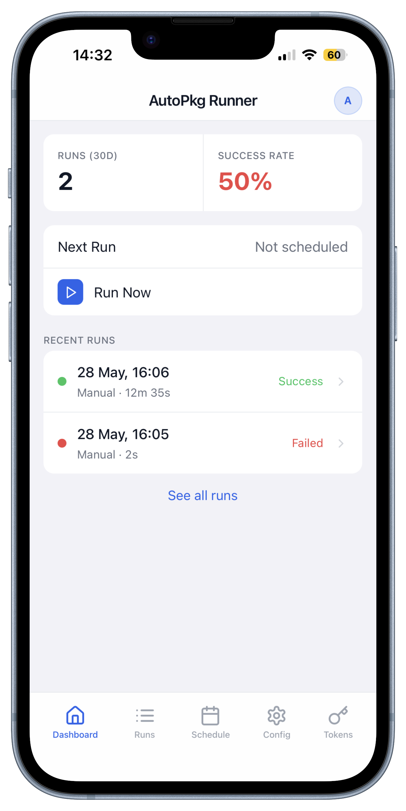

# AutoPkg Runner

[](LICENSE)<br>


A web-based management interface for [AutoPkg](https://github.com/autopkg/autopkg) - the macOS software packaging automation tool. AutoPkg Runner wraps your AutoPkg workflows in a Django web application with real-time run monitoring, a REST API, a mobile PWA, and scheduled execution.

## Features

### Web UI

- **Dashboard** - last run summary, 30-day success rate, next scheduled run, and a one-click manual trigger
- **Run detail** - GitHub Actions-style stage timeline with live log streaming; stage status icons and the log panel update in real time without a page refresh
- **Run history** - paginated list of all pipeline executions with status badges and duration
- **Run cancellation** - cancel an in-progress run from the run detail page
- **Run sharing** - generate a shareable, unauthenticated link to any completed run report; optional expiry window configurable in notification settings
- **Schedule** - cron-based scheduling with an enable/disable toggle; changes apply immediately without a server restart
- **Recipes** - full AutoPkg recipe management (see [Recipes](#recipes) below)
- **Configuration** - full pipeline configuration through the browser
- **Users** - create and manage user accounts, reset passwords
- **API tokens** - create and revoke per-user tokens for REST API access

### Recipes

The Recipes section replaces AutoPkgr for day-to-day recipe management. It is organised into four sub-tabs:

#### Repositories

- Lists all AutoPkg recipe repositories with their remote URL and git status (up to date / N commits behind / unknown)
- Add a repository by URL — runs `autopkg repo-add` in the background
- Remove a repository — runs `autopkg repo-delete`
- Update a repository inline — the row shows a spinner while `autopkg repo-update` runs, then refreshes with the new status

#### Recipe List

- Browses all recipes found across all configured repository search directories
- Supports both `.recipe` (XML/plist) and `.recipe.yaml` (YAML) recipe formats
- Displays parent recipes and their overrides as separate, clearly labelled rows
- Toggle any recipe or override into or out of the active run list with a single click — changes write directly to the recipe list file on disk
- Inline search and filtering across all available recipes
- **Missing parent detection** — highlights recipes whose declared parent recipe is not installed on the system, with a warning icon on the row and a summary banner at the top of the page
- **Orphan run-list detection** — identifies entries in the run list file that no longer match any known recipe or override, listed separately so stale entries can be cleaned up
- Identifier-based deduplication ensures recipes from different repos with the same filename are both shown

#### Find Recipes

- Searches the [AutoPkg community recipe index](https://github.com/autopkg/index) — over 15,000 recipes maintained by the AutoPkg organisation
- Index is fetched from GitHub on first load and refreshed automatically every hour; a manual refresh button is available in the search bar
- Full-text search across recipe name, identifier, parent, and repository
- Paginated results sorted alphabetically
- Each row shows the recipe name, full identifier, parent identifier (where applicable), and a pill indicating whether the recipe's repository is already installed
- Add a missing repository directly from the search results — clicking the add button opens a confirmation modal that walks the full parent chain, listing every repository required and whether each is already installed
- View any recipe file on GitHub with the globe button on each row

#### Override Editor

- Lists all recipe overrides in `~/Library/AutoPkg/RecipeOverrides/` with their active status
- Create a new override from any recipe with one click — runs `autopkg make-override` and redirects straight to the editor
- Full-featured CodeMirror XML editor with line numbers and syntax highlighting; switches to a dark theme automatically when the app is in dark mode
- Save validates XML before writing; parse errors are shown inline without overwriting the file

### Mobile PWA

- Installable progressive web app with an iOS-native look and feel
- Bottom tab bar navigation with SPA-style page transitions
- Real-time stage status updates and live log streaming on run detail
- Install directly from Safari - no App Store required



### Notifications

Seven notification providers are supported. Multiple notifiers can be configured and each can have its own custom title and message template.

| Provider | Notes |
|-|-|
| **Pushover** | Push notification to iPhone/iPad/Mac via the Pushover app |
| **Discord** | Message to a Discord channel via an incoming webhook |
| **WebPush** | Native browser push notification - works with the installed PWA or any subscribed browser session |
| **Email (SMTP)** | Email via any SMTP server; supports STARTTLS and SSL, optional authentication |
| **Slack** | Message to a Slack channel via an incoming webhook |
| **Microsoft Teams** | Message to a Teams channel via an incoming webhook |
| **Google Chat** | Message to a Google Chat space via an incoming webhook |

Notifications are always dispatched at the end of a run regardless of whether earlier pipeline stages succeeded or failed.

Notification message and title fields support template variables:

| Variable | Description |
|-|-|
| `{status}` | Run outcome (`success` / `failure`) |
| `{status_emoji}` | Emoji representing the outcome |
| `{imports}` | Number of items imported |
| `{failures}` | Number of recipe failures |
| `{downloads}` | Number of items downloaded |
| `{duration}` | Run duration |
| `{share_url}` | Raw share-link URL (plain text) |
| `{share_link:"text"}` | Clickable HTML hyperlink to the share report — HTML notifiers only (e.g. Pushover with HTML enabled). Single or double quotes both accepted. Expands to nothing if no share URL is configured. |
| `{run_id}` | Run UUID |
| `{triggered_by}` | Who or what triggered the run |
| `{date}` / `{time}` | Run date and time |

### REST API

All endpoints support both JSON (`Accept: application/json`) and XML (`Accept: application/xml`) responses. Token authentication is required for all endpoints except `get_token`.

| Method | Endpoint | Description |
|--|-|-|
| `POST` | `/api/auth/get_token/` | Exchange username + password for an API token |
| `GET` | `/api/auth/check_token/` | Validate a token |
| `POST` | `/api/tasks/trigger_run/` | Start a pipeline run - returns a task UUID |
| `POST` | `/api/tasks/trigger_db_cleanup/` | Start a DB cleanup task - returns a task UUID |
| `GET` | `/api/tasks/get_task_status/?uuid=` | Poll the status of a task |
| `GET` | `/api/history/get_run_data/?uuid=` | Full run detail including stages, logs, and recipe results |
| `GET` | `/api/history/list_runs/` | List runs; optional `start_date` / `end_date` query filters |

### Pipeline

The pipeline runs these stages in order:

1. **Environment Check** - validates the AutoPkg binary and recipe list exist and are readable
2. **Update Repos** - runs `autopkg repo-update all` to pull the latest recipe repos (optional, can be disabled per run or toggled in Workflow settings)
3. **Trust Verification** - runs `autopkg verify-trust-info` on all recipes and updates trust as needed
4. **Mount Repository** - connects to the Munki repository over SMB or SFTP
5. **Run AutoPkg** - batch executes all configured recipes and writes a report plist
6. **Generate Report** - renders a timestamped HTML report from a Django template
7. **Garbage Collector** - prunes old cache files, temp files, and stale HTML reports using `repoclean`
8. **Send Notifications** - dispatches alerts to all configured notifiers


## Requirements

- macOS (AutoPkg is macOS-only)
- Python 3.9+
- [AutoPkg](https://github.com/autopkg/autopkg) installed

> **Full Disk Access required**
>
> Both the Python interpreter used to run AutoPkg Runner **and** the Python interpreter bundled with AutoPkg itself must be granted Full Disk Access in **System Settings → Privacy & Security → Full Disk Access**. Without this, AutoPkg recipes that read from or write to protected locations (including SMB-mounted shares in a system daemon session) will fail with a permission error at runtime.
>
> The typical entries to add are:
> - The `python3` binary used to launch AutoPkg Runner (e.g. `/opt/homebrew/bin/python3` or a venv interpreter)
> - AutoPkg's bundled Python at `/Library/AutoPkg/Python3/Python.framework/Versions/Current/bin/python3`


## Installation

```bash
git clone https://github.com/yourorg/autopkg-runner.git
cd autopkg-runner
pip3 install -r requirements.txt
python3 manage.py setup
python3 manage.py serve
```

`manage.py setup` runs all database migrations, creates the default schedule row, and generates an admin account with a random password printed to the terminal.

Open `http://127.0.0.1:8000` and log in with the credentials shown. All configuration is done through the web UI.


## Management commands

| Command | Description |
|-|-|
| `autopkg-runner setup` | One-shot initialisation: migrate, create defaults, generate admin account |
| `autopkg-runner serve` | Start the server (`--bind`, `--port`, `--workers`, `--threads`) |
| `autopkg-runner resetpassword <user>` | Generate and set a new random password for a user account |
| `autopkg-runner generate_vapid_keys` | Generate VAPID keys for WebPush notifications and store them in the database |
| `autopkg-runner install_sftp_deps` | Install macFUSE and sshfs via Homebrew (required for SFTP repository connections) |
| `autopkg-runner service_daemon --install --user <username>` | Install autopkg-runner as a macOS launchd system daemon (see [Running as a system service](#running-as-a-system-service)) |
| `autopkg-runner service_daemon --remove` | Stop and remove the installed launchd system daemon |


## Configuration

All settings are stored in the database and managed through the **Configuration** page in the web UI.

| Group | Key settings |
|-|-|
| **AutoPkg** | Binary path, cache path, recipe list path, report plist path |
| **Workflow** | Toggle automatic repo updates before each run |
| **Repository** | Connection type (SMB or SFTP), host, share name, mount path, public URL, credentials, directories to validate |
| **Garbage Collector** | `repoclean` binary path, retention period (e.g. `2w`), versions to keep, what to clean |
| **Notifications** | Configured notifiers with per-notifier credentials and message templates |
| **Logging** | Log level, optional file logging with path |
| **UI** | Interface language |

### Environment variables

In the **`.app` bundle** these are set via the launchd plist at `~/Library/Application Support/com.bytefloater.autopkg-runner/com.bytefloater.autopkg-runner.plist`. `DJANGO_SECRET_KEY` is auto-generated on first run if absent. In **dev** they are read from a `.env` file in the project root.

| Variable | Required | Default | Description |
|-|-|-|-|
| `DJANGO_SECRET_KEY` | Yes | *(auto-generated in bundle)* | Django cryptographic secret. Auto-generated and persisted on first bundle launch. In dev, set this in `.env`. Must be kept stable across restarts — changing it invalidates all sessions and CSRF tokens. |
| `DJANGO_ALLOWED_HOSTS` | No | `localhost 127.0.0.1` | Space-separated list of hostnames the server will respond to. Add your machine's hostname or IP address here to allow access from other devices on the network, e.g. `DJANGO_ALLOWED_HOSTS=localhost 127.0.0.1 myserver.local 192.168.1.10`. |
| `DJANGO_DEBUG` | No | `false` | Set to `true` to enable Django debug mode. Enables detailed error pages and disables several security hardening settings. Never enable in production. |
| `DJANGO_HTTPS_REDIRECT` | No | `false` | Set to `true` to redirect all HTTP traffic to HTTPS and enable `Strict-Transport-Security` headers. Only enable if the server is behind a TLS-terminating reverse proxy. |
| `DJANGO_HSTS_SECONDS` | No | `31536000` | Max-age for the `Strict-Transport-Security` header in seconds (default: 1 year). Only applies when `DJANGO_HTTPS_REDIRECT=true`. |


## Scheduling

Scheduled runs are configured on the **Schedule** page. Enable the toggle and set the cron fields (minute, hour, day of week, day of month, month). Changes apply immediately - no server restart required.


## Localisation

The UI ships with English (en-US) and French (fr-FR) translations. Switch languages under **Configuration → UI**. Additional languages can be added by creating a new JSON file in `webapp/translations/`.

> Non-english translations are still a work in progress. If you are able to assist with the translations into additional languages, contributions are welcome.


## REST API usage

### Get a token

```bash
curl -X POST http://localhost:8000/api/auth/get_token/ \
  -d "username=admin&password=yourpassword"
```

```json
{ "token": "abc123..." }
```

### Trigger a run

```bash
curl -X POST http://localhost:8000/api/tasks/trigger_run/ \
  -H "Authorization: Token abc123..."
```

```json
{ "task_uuid": "d4e5f6..." }
```

### Poll task status

```bash
curl "http://localhost:8000/api/tasks/get_task_status/?uuid=d4e5f6..." \
  -H "Authorization: Token abc123..."
```

### Get XML output

Add `-H "Accept: application/xml"` to any request to receive an XML response instead of JSON.


## SFTP repository support

SFTP connections require macFUSE and sshfs. Install them with:

```bash
python3 manage.py install_sftp_deps
```

This installs macFUSE and sshfs via Homebrew. macFUSE requires a system reboot and kernel extension approval in **System Settings → Privacy & Security** after installation.


## Production deployment

The Django development server is single-threaded and will block on SSE connections. For production, use a multi-threaded WSGI server:

```bash
pip3 install gunicorn
gunicorn autopkgrunner.wsgi:application --workers 1 --threads 8 --bind 0.0.0.0:8000
```

Set `DJANGO_DEBUG=false` and `DJANGO_ALLOWED_HOSTS` to your server's hostname. Restrict permissions on the database file since it contains API tokens and repository credentials:

```bash
chmod 600 db.sqlite3
```

Set a stable `DJANGO_SECRET_KEY` in production — this value is used to encrypt all stored credentials (repository passwords, notifier tokens). Rotating the key will invalidate any encrypted values in the database.


## Running as a system service

autopkg-runner can be installed as a macOS launchd system daemon that starts automatically at boot, runs under a dedicated user account, and is managed by the operating system.

### Prerequisites

- The `.app` bundle must be installed in `/Applications/` or `~/Applications/`. macOS TCC blocks system daemon processes from accessing user-protected directories (Desktop, Documents, Downloads, etc.) when launched from other locations.
- All files under the app must be owned by the user account the daemon will run as.

```bash
# Install the daemon (a macOS authentication dialog will appear)
autopkg-runner service_daemon --install --user autopkg
```

A macOS authentication dialog will appear to request administrator credentials for the privileged writes. Alternatively, run the command under `sudo` to skip the dialog.


1. Validate the user account, app location, and TCC status
2. Render a launchd plist configured to launch the server with the specified options
3. Write the plist to `/Library/LaunchDaemons/` with the correct ownership and permissions
4. Create `/var/log/com.bytefloater.autopkg-runner/` for server logs
5. Load the service immediately via `launchctl bootstrap system`

### Options

| Flag | Default | Description |
|-|-|-|
| `--user <username>` | *(required)* | macOS user account the service process runs as |
| `--bind <address>` | `127.0.0.1` | Address the server binds to |
| `--port <port>` | `8000` | Port the server listens on |
| `--workers <n>` | `1` | Number of worker processes |
| `--threads <n>` | `8` | Number of threads per worker |

### Useful commands

```bash
# Check service status
launchctl print system/com.bytefloater.autopkg-runner

# View server logs
tail -f /var/log/com.bytefloater.autopkg-runner/server.log

# Remove the service
autopkg-runner service_daemon --remove
```

### Granting Permissions — do this before installing the service daemon

macOS permission prompts (TCC dialogs) can only be shown to the user when a process is running in an interactive session with a logged-in user. The launchd system daemon runs headlessly in the system session, so **it can never show permission prompts** — any access that hasn't already been approved is silently blocked.

**Before** installing the service daemon, run the application at least once from a Terminal window while logged in as the user who will own the daemon:

```
autopkg-runner serve
```

Then open the web UI and trigger a manual AutoPkg run. Approve every permission dialog that appears — typically:

- **Full Disk Access** — grant in System Settings → Privacy & Security → Full Disk Access
- **Local Network** — click Allow when prompted
- **Remote volume access** — click Allow when AutoPkg first accesses a network share (SMB/AFP/NFS)

Once all prompts have been approved and a test run completes successfully, install the service daemon:

```
autopkg-runner service_daemon --install --user <username>
```

The daemon will inherit the approved permissions and operate without further prompts.

> **Note for MDM deployments:** TCC permissions can be pre-granted via a `PrivacyPreferencesPolicyControl` configuration profile deployed through your MDM (Jamf, Mosyle, Kandji, etc.), bypassing the need for interactive approval. This only works on MDM-supervised devices.

### Full Disk Access

When running as a launchd system daemon, the service operates in a system session with stricter macOS security policy than a normal user session. Both Python interpreters listed in [Requirements](#requirements) must be granted Full Disk Access, or AutoPkg recipes will fail at runtime with a permission error.

### Local Network Access

On macOS 11 and later, accessing local network services (including Bonjour/mDNS discovery used to locate shared repositories) requires explicit user approval. AutoPkg Runner will prompt for this permission automatically on first launch. If the prompt does not appear, check **System Settings → Privacy & Security → Local Network**.

### Network Volume Access

macOS gates access to SMB, AFP, and NFS mounts under a separate TCC permission — **Full Disk Access does not cover network volumes**. These are treated as a distinct category because the data traverses the network. When AutoPkg Runner first attempts to read from or write to a network-mounted share, macOS will show a prompt: *"AutoPkg Runner would like to access data on a remote volume."* Approve it to allow recipe syncing and package staging on network shares.

This prompt fires on first access of a mounted network volume, not at startup. If it was dismissed or denied, reset it with:

```
tccutil reset SystemPolicyNetworkVolumes com.bytefloater.autopkg-runner
```

Then trigger a run in the Web Interface to re-trigger the prompt.

## License

Apache 2.0 - see [LICENSE](LICENSE).
